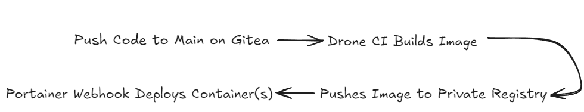

# Self-Hosted CI/CD Pipeline with Gitea, Drone, and Portainer
This repository documents a self-hosted CI/CD pipeline used to automatically build, publish, and deploy Dockerized applications within an existing Gitea and Portainer-based infrastructure. The pipeline integrates Drone CI, a private Docker registry, and Portainer stacks to support multiple internal projects with minimal per-project configuration.

All design decisions were made to align with pre-existing infrastructure and operational constraints while improving deployment consistency and reliability.

## Why This Pipeline
This pipeline was built to improve the existing deployment workflow under the following constraints:

- All tooling needed to be fully self-hosted due to internal network and data sensitivity
- Gitea was already used for source control
- Portainer was already used for container deployment
- Deployments needed to be simple enough for non-DevOps engineers
- Rollbacks needed to be possible without rebuilding images

## Architecture Overview and Design Rationale
### Gitea
- Existing internal Git service used for source control
- Acts as the event source for CI pipeline triggers
### Drone CI
- Selected due to native integration with Gitea
- Used exclusively for CI tasks: building Docker images and pushing them to a private registry
- Runs pipelines in isolated containers, aligning well with a Docker-based environment
### Private Docker Registry
- Required to store internally built images
- Enables Portainer stacks to pull versioned images during deployment
- Supports image-based rollback without triggering new CI builds
### Portainer Stacks
- Used for declarative container deployment via `docker-compose.yml`
- Simplifies redeployment and rollback by centralizing runtime configuration
- Aligns with existing operational workflows
### Webhooks
- Used to trigger stack redeployments automatically after successful image builds
- Eliminates the need for manual intervention or direct access to deployment servers

## End-to-End Deployment Flow
1. Code is pushed to the `main` branch in Gitea
2. Drone CI triggers a pipeline build
3. A Docker image is built and tagged using the Drone build number
4. The image is pushed to a private registry
5. A Portainer webhook redeploys the stack using the new image

## Known Limitations and Challenges
- The pipeline was most effective for single-image services  
- Coordinating deployments for multi-image applications introduced complexity around versioning and rollback
- Deployments were not atomic across multiple images
- No centralized monitoring, logging, or health checks were implemented

## Future Improvements
- Add health checks and automated rollback on failure
- Introduce centralized logging and monitoring
- Improve support for multi-image application deployments
- Add pre-deployment test stages to the CI pipeline